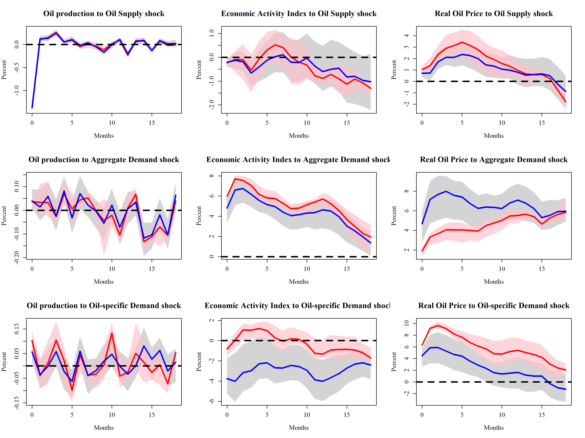

<!-- README.md is generated from README.Rmd. Please edit that file -->

# VARS

<!-- badges: start -->

<!-- badges: end -->

The goal of VARS is to implement various VAR estimation and
identification approaches, as well as inference tools.

## Progress

- [x] basic VAR model and VAR tools (IRF, FEVD, HDC)
- [x] classic VAR, i.e. OLS estimation, IV and recursive identification,
  bootstrap
- [x] bayesian VAR with (narrative) sign restrictions
- [x] add test data and code to the R package
- [x] add function and data documentation

## Installation

You can install the development version of VARS from
[GitHub](https://github.com/) with:

``` r
# install.packages("pak")
pak::pak("GoldenBaozi/VARS")
```

## Example

This is a basic example which estimates a simple VAR and identify using
Cholesky decomposition, using [Stock and Watson
(2001)](https://www.aeaweb.org/articles?id=10.1257/jep.15.4.101) data

``` r
library(VARS)
# load data
data(SW2001)
# initialize var model
var1 <- cVAR$new(data = SW2001, p.lag = 4)
# OLS estimation
var1$est()
# recursive identification with block bootstrap
var1$identify(method = "recursive", boot.method = "block")
# compute IRF
IRF.1 <- var1$tool("IRF", 20, 0.90)
# plot preparation
shock.names <- var.names <- c("unemp", "infl", "ffr")
IRFs <- list(IRF.1)
# plot IRF
IRF.plot(var1, IRFs, 20, shock.names, var.names)
```

## Replic

Replication of Antolín-Díaz and Rubio-Ramírez (2018), figure 2

<figure>

<figcaption aria-hidden="true">IRFs of global oil market</figcaption>
</figure>

For more results, see `./tests/testthat/`
