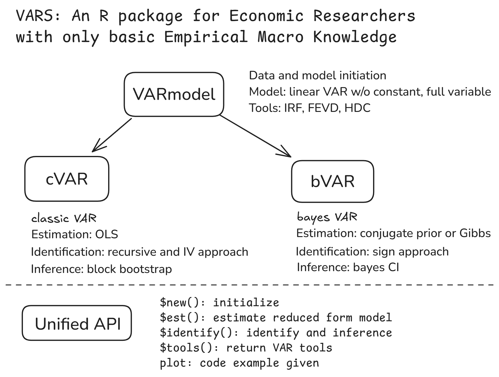

# 引言

结构向量自回归模型 (structural vector auto-regression, SVAR) 已经成为现代宏观经济学实证研究中使用最为广泛的计量模型之一。使用SVAR进行实证宏观经济研究的主要目的，是探究各宏观经济变量之间的动态因果关系，如“去年10月实行的宽松货币政策，将如何在一年内影响国内生产总值与价格水平？”这类问题。使用SVAR进行实证宏观研究主要包括模型建立、估计、识别和推断四个步骤，其中的关键步骤是识别 (identification)，即如何在模型设定下，将自变量 $X$ 对因变量 $Y$ 的效应从其他影响路径中分离出来，从而得到有因果含义的解释。

为了方便自己开展宏观经济学实证研究，我们参考领域核心文献[@rubio-ramirez2010; @Kilian_Lütkepohl_2017; @antolin-diaz2018]，使用R语言与 `Rcpp` 包编写了R包 [`VARS`](https://github.com/GoldenBaozi/VARS)，该R包实现了SVAR模型的**OLS和贝叶斯估计**这两种估计方法，**递归识别法、符号约束法和外部工具变量法**这三种识别方法，以及**脉冲响应函数、预测误差方法分解和历史分解**这三种推断工具，可以用于开展完整的实证宏观经济学研究。

本文给出了 `VARS` 包的使用指南，以及使用软件包开展的论文复现研究结果。在第二节，我们简要介绍软件包背后的统计理论；在第三节，我们简要介绍软件包的主要框架；在第四节，我们展现利用软件包开展的实证研究复现结果，同时给出相应代码。

# 理论模型

## 宏观经济学中的因果推断

假设我们想研究宏观经济学中的一个经典问题“货币政策能否影响实际产出水平”，即货币政策工具 (如利率水平) 对实际产出 (真实GDP) 是否存在因果效应，我们应该如何开展实证研究呢？首先，注意到由于种种限制，宏观经济政策是无法进行随机对照实验的，其次，由于宏观经济学的研究对象是一个国家的经济指标，也很难通过观测获得对照样本。从而在其他因果研究中广泛使用的潜在因果框架无法用于实证宏观经济学中的因果效应研究。

因此，想要估计宏观因果效应，通常的做法是利用经济理论构建包含未知参数的经济模型，进而利用统计学方法估计模型中的未知参数，进而利用模型来构建反事实，从而得到具有因果含义的结论。这其中的一个关键假设是：模型以外的变量不会同时影响我们关注的自变量和因变量，即没有遗漏变量问题 (这个假设很强，其等价于潜在因果框架下认为观测数据就是独立的)。给定这一假设，估计宏观因果效应问题，实际上简化为了：给定一个结构方程，其中每个变量的数据生成过程 (data generating process, DGP) 是相互影响的，将各个变量之间的因果关系分离出来。

以上述货币政策问题为例，我们假设对这个问题重要的变量只有产出、价格和货币政策工具变量，也就是实际生产总值 (real GDP, $y$)、商品价格指数 (CPI, $p$) 和名义利率 (nominal interest rate, $i$)，并假设经济动态可以由以下离散随机动力系统来刻画
$$
(y_{t}, p_{t}, i_{t}) = F(\text{lags}; \epsilon^{y}_{t}/ \epsilon^{p}_{t}/ \epsilon^{i}_{t})
$$
除此之外的变量均无法同时影响产出和货币政策。其中，lags表示三个变量的所有 $q$ 阶滞后项，$\epsilon_{t}$ 表示每个变量所对应的一个随机变量，其分布未知。以上我们假设了经济系统中的数据生成过程：我们认为每个当期变量是由所有变量的滞后项lags和该变量对应的随机变量当期的实现 $\epsilon_{t}$ 所生成的。为了与经济学理论相对应，我们将每个随机变量在当期的取值解释为其对应变量在当期“未被人们预期到的冲击” (innovation)。为了分析因果效应，还需要假设每个随机变量在时间序列上严平稳，在横截面上独立。有了这些假设，我们可以定义因果效应分析工具——脉冲响应函数 (impulse-response function, IRF)
$$
\Phi^{h} \equiv \frac{\partial (y_{t+h}, p_{t+h}, i_{t+h})}{\partial (\epsilon^{y}_{t}, \epsilon^{y}_{t}, \epsilon^{y}_{t})}
$$
其中，$\Phi^{h}_{ij}$ 表示的是变量 $j$ 在当前期未预期到地上升1单位，对变量 $i$ 在 $h$ 期后取值的影响，其本质上是一个反事实，从而具有因果含义。上述几个假设对于这一工具的因果含义缺一不可：

- 如果存在遗漏变量，或者 $\epsilon_{t}$ 在横截面上不独立，那么 $\Phi^{h}_{ij}$ 反映的就不是变量 $j$ 对 $i$ 的因果效应，而包含了混杂因素
- 如果 $\epsilon_{t}$ 在时间序列上不是严平稳，那么冲击就会被预期到，而一旦人们预期到经济变量在未来的变化，就会相应地调整其行为。因此在下一个冲击发生时，经济动态就不会按照用历史数据估计出来的模型那样演化，原先的反事实结果也就没有了意义

到这里为止，我们已经完成了理论模型的设定与因果效应的定义。接下来的假设是为了估计的方便。注意到如果不存在随机性，我们可以找到动力系统的一个不动点，称作宏观经济的稳态，根据分析中相关理论，在不动点附近，可以用线性系统去近似非线性系统，并且至少能保证符号正确。这样，就可以用线性模型来拟合上述非线性模型
$$
\begin{pmatrix}
        y_{t} \\
        p_{t} \\
        i_{t}
\end{pmatrix} = \sum_{k=1}^{q} \begin{pmatrix}
        \beta_{11}^{k} & \beta_{12}^{k} & \beta_{13}^{k} \\
        \beta_{21}^{k} & \beta_{22}^{k} & \beta_{23}^{k} \\
        \beta_{31}^{k} & \beta_{32}^{k} & \beta_{33}^{k} \\
    \end{pmatrix} \begin{pmatrix}
        y_{t-k} \\
        p_{t-k} \\
        i_{t-k}
    \end{pmatrix} + \begin{pmatrix}
        \epsilon^{y}_{t} \\
        \epsilon^{p}_{t} \\
        \epsilon^{i}_{t}
    \end{pmatrix} \tag{1}
$$
最后，利用中心极限定理，大样本下任何的分布可以为正态分布所近似，我们假设 $\epsilon_{t}$ 服从独立的正态分布，从而得到了经典的SVAR模型，也就是 (1) 式。

## SVAR的识别问题

对应 (1) 式，我们构建估计式
$$
\begin{pmatrix}
        y_{t} \\
        p_{t} \\
        i_{t}
\end{pmatrix} = \sum_{k=1}^{q} \begin{pmatrix}
        \beta_{11}^{k} & \beta_{12}^{k} & \beta_{13}^{k} \\
        \beta_{21}^{k} & \beta_{22}^{k} & \beta_{23}^{k} \\
        \beta_{31}^{k} & \beta_{32}^{k} & \beta_{33}^{k} \\
    \end{pmatrix} \begin{pmatrix}
        y_{t-k} \\
        p_{t-k} \\
        i_{t-k}
    \end{pmatrix} + \begin{pmatrix}
        u^{y}_{t} \\
        u^{p}_{t} \\
        u^{i}_{t}
    \end{pmatrix} \tag{2}
$$
或者
$$
\begin{aligned}
    \boldsymbol{y}_{t}' &= \boldsymbol{x}_{t}'(\beta^{1}, \ldots ,\beta^{q}) + u_{t}'\\
    &= \boldsymbol{x}_{t}' \beta + u_{t}'
\end{aligned}
$$
直接估计 (2) 式，得到估计值 $\hat{\beta}$，可以证明IRF $\equiv \Psi$ 满足
$$
\beta_{*} \equiv \begin{pmatrix} 
    \beta^{1} &  \cdots & \beta^{q-1} & \beta^{q} \\
    \mathbb{I} &  & & 0 \\
    & \ddots & & \vdots \\
    & & \mathbb{I} & 0
\end{pmatrix}, \; \Psi^{h} = \mathbf{e}_{n}'\beta^{h}_{*}\mathbf{e}_{n}, \; \mathbf{e}_{n}=(\mathbb{I}_{n\times n},0, \ldots ,0)'
$$
问题在于，(2) 中的残差 $u_{t}$ 在大部分情况下并非独立随机变量，从而估计式 (2) 与数据生成过程 (1) 无法对应，得到的IRF也没有因果含义。因此，我们对估计式进行调整，得到
$$
\boldsymbol{y}_{t}' = \boldsymbol{x}_{t}' \beta + \epsilon_{t}' B \tag{3}
$$
其中，矩阵 $B$ 是一个待估计的矩阵，其作用是将独立的冲击转化为我们观测到的混杂的残差。遗憾的是，(3) 式是无法直接估计的，因为我们缺乏足够的矩条件将其中的所有参数识别出来，这主要是因为我们缺乏 $\epsilon_{t}$ 的观测数据，因此能利用的唯一样本矩是
$$
\mathbb{E}(uu') \equiv \Sigma = B'\mathbb{E}(\epsilon \epsilon')B = B' \operatorname{diag}(\sigma^2_{1},\sigma^2_{2},\sigma^2_{3})B = \tilde{B}' \tilde{B} \tag{4}
$$
其中 $\tilde{B}:=\operatorname{diag}(\sigma_{1},\sigma_{2},\sigma_{3})B$。注意到 $\tilde{B}$ 中有 $n^{2}$ 个待估计参数，而 $\Sigma=\tilde{B}' \tilde{B}$ 只提供了 $n(n+1)/2$ 个条件。这说明在不施加额外假设的情况下，我们是无法识别估计式 (3) 的。

从另一个角度去看这个问题，我们在 (3) 式两边同时乘以 $B^{-1}$，得到
$$
\begin{aligned}
    \boldsymbol{y}_{t}'A_{0} &= \boldsymbol{x}_{t}'A_{+} + \epsilon_{t}' \\
    \implies \boldsymbol{y}_{t}' &= \boldsymbol{y}_{t}'(I-A_{0}) + \boldsymbol{x}_{t}'A_{+} + \epsilon_{t}' \\
    &\equiv \tilde{\boldsymbol{x}}_{t}' \tilde{\beta} + \epsilon_{t}' \tag{5}
\end{aligned}
$$
对 (5) 式的每一个方程进行OLS估计，得到的估计量 $\hat{\beta}$ 不是一致的，因为 $\mathbb{E}(\tilde{\boldsymbol{x}}_{t}' \cdot \epsilon_{t}') \neq \mathbf{0}$，从而得到的IRF也是有偏误的。

综合以上，实证宏观经济研究的核心正是SVAR的识别问题，这就要求研究者基于经济学理论或者经验事实添加额外的约束条件，使得计算IRF所需的所有参数能够得到恰当的识别。目前主流文献中使用的识别条件主要是**符号约束法**。

## 识别方法

### 符号约束法

第一类识别方法可以由 (4) 式引出，既然缺乏 $n(n-1)/2$ 个条件，那就通过假设把这些条件补足即可。最直截了当的做法是假设 $B$ 矩阵为上三角
$$
(u^{y}_{t}, u^{p}_{t}, u^{i}_{t})
= (\epsilon^{y}_{t}, \epsilon^{p}_{t}, \epsilon^{i}_{t}) \begin{pmatrix} 
    b_{11} & b_{12} & b_{13} \\
    0 & b_{22} & b_{23} \\
    0 & 0 & b_{33} 
\end{pmatrix} 
$$
这样就有足够的条件把 $B$ 矩阵完全算出来了，从而可以得到有因果含义的IRF
$$
\Phi = \Psi \tilde{B}'
$$
上述假设的含义是：在方程组中排序在前的变量，在当期不受到排序在后的变量的未预期冲击影响，其自身的未预期冲击则会在当期影响排序在后的变量。使用这一假设的识别方法称为**递归识别法** (recursive identification)，其优点是简单易行，只要对 (2) 中估计出来的协方差矩阵做Cholesky分解，取上三角因子即为 $\tilde{B}$ 矩阵了。其缺点是假设太强，许多时候不符合现实。比如说，经验事实告诉我们，一国的价格水平对于利率变化是很敏感的，此时上三角假设中 (3,2) 位置的0就与现实不符。

既然假设 $B$ 矩阵某些位置上为0 (或者其他给定值) 不够现实，那么我们考虑放松假设：仅仅假设某些位置上值的符号为正或者为负，例如
$$
(u^{y}_{t}, u^{p}_{t}, u^{i}_{t})
= (\epsilon^{y}_{t}, \epsilon^{p}_{t}, \epsilon^{i}_{t}) \begin{pmatrix} 
    + & + & + \\
    - & + & + \\
    - & - & + 
\end{pmatrix} 
$$
其中，$b_{21}<0$ 要求的是模型估计结果需满足价格对产出的当期影响为负。这一类假设对应的识别方法称为**符号约束法**，其往往有经济理论作为支撑，且可以被现实数据所验证，得到的结果相对可信，因此在近年来的实证宏观经济学的文献中得到了广泛的应用。符号约束法的问题在于，我们得不到唯一的识别结果。假设 $\bar{B}$ 满足我们设定的符号约束，并且满足 $\bar{B}'\bar{B}=\Sigma$，那么，总可以找到某些正交矩阵 $Q$，使得 $\mathcal{B}=Q \bar{B}$ 仍然满足符号约束，并且 $\mathcal{B}'\mathcal{B}=\Sigma$ 。因此，使用符号约束法时，SVAR模型无法得到点识别 (point-identification)，而只能是集合识别的 (set-identification)，即最终得到的结果是一个满足条件的参数集合。在贝叶斯的观点下，我们所施加的约束就是对参数的先验分布做假设，得到的识别结果就是参数的后验分布。

### 算法实现

我们参考相关文献[@rubio-ramirez2010; @antolin-diaz2018]实现了SVAR的符号约束法，其主要思想是对简约式参数 $\beta,\Sigma$ 和正交矩阵 $Q$ 进行抽样，利用得到的样本计算结构参数 $A_{0},A_{+}$，进而得到IRF和历史分解等重要统计量，然后检验这些统计量是否满足给定的约束，如果满足就保留，不满足就舍弃。如此进行大量抽样后，可认为得到的IRF的集合就是我们所需要的，具有因果含义的IRF的后验分布。下面介绍算法的主要步骤。

**一些记号**. 简约式参数 $(\beta, \Sigma)$，结构式参数 $\Theta=(A_{0},A_{+})$，结构冲击 $\varepsilon$，结构IRF $\Phi_{ij}^{h}$，正交矩阵 $Q$，简约式参数到结构式参数的映射
$$
f: (\beta, \Sigma, Q) \mapsto \Theta=(A_{0}, A_{+})=\left((\texttt{chol}(\Sigma)Q)^{-1}, \beta A_{0}\right)
$$
第一类符号约束 (作用于IRF) $\Gamma(\Theta)$，第二类符号约束 (作用于历史分解) $\Upsilon(\Theta,\varepsilon)$。

**算法实现**. 给定先验分布 $\Sigma \sim \text{InvWishart}(S,\tau), \; \beta | \Sigma \sim \mathcal{N}(u, I \otimes \Sigma), P \sim \text{Haar}(0,1)$，以及两类符号约束，以下算法从结构式IRF的后验分布中抽取样本：

1. 计算 $\Sigma,\beta$ 的共轭后验分布，从中抽取后验样本 $\hat{\beta}, \hat{\Sigma}$
2. 对上述后验样本，从 $\text{Haar}(0,1)$ 矩阵进行 $M$ 次抽样，得到 $P(1), \ldots ,P(M)$
   1. 对 $P(i)$ 进行QR分解，得到 $QR=\texttt{qr}(P(i))$，$Q$ 即为正交矩阵
   2. 计算结构参数 $\Theta=f(\hat{\beta}, \hat{\Sigma}, Q)$，检验 $\Gamma(\Theta)$ 是否满足，满足就留下，不满足就舍弃
3. 检查保留样本数是否达到预设要求。 若未达到，返回步骤1
4. 对每一个保留下来的样本，检验 $\Upsilon(\Theta,\varepsilon)$ 是否满足，
   1. 若满足，从 $\mathcal{N}(\mathbf{0}, \mathbf{1})$ 中抽取结构冲击 $\varepsilon^{j}$，重新检验 $\Upsilon(\Theta,\varepsilon^{j})$ 是否满足，重复 $N$ 次，记满足次数为 $K$，用 $\frac{N}{K}$ 近似分布的权重 $\omega$
   2. 若不满足，就舍弃
5. 对步骤4中保留的样本使用权重 $\omega$ 进行抽样，得到满足所有约束的后验结构参数分布，计算结构IRF，使用中位数和 68% 高概率密度区间进行推断。

# R包架构

我们的R包 `VARS` 主要实现了3个`R6`类

- `VARmodel` 实现了SVAR数据与模型结构，以及IRF、FEVD和FDC三种推断工具的计算，这些方法被以下两个类所继承
- `cVAR`也就是传统VAR，实现了基于递归识别和工具变量识别的SVAR，使用Bootstrap方法进行推断
- `bVAR`也就是贝叶斯VAR，实现了基于符号约束识别法的SVAR，使用贝叶斯后验分布进行推断
- 代码包后端计算全部基于`Rcpp`，并提供了一致的`R`函数接口，用户仅需理解参数含义并指定参数即可，不需要理解算法细节；当然，高级用户也可以基于软件包进行二次开发

# 论文复现

# 小结

事实证明我们可以理直气壮地通过XeLaTeX将中文R Markdown转化为PDF文档，麻麻再也不用担心我的论文满屏幕都是反斜杠，朕养完小白鼠之后终于不必先折腾三个小时LaTeX再开始写实验报告了：打开RStudio，菜单File > New File > R Markdown，然后从模板中选择CTeX Documents，搞定。
